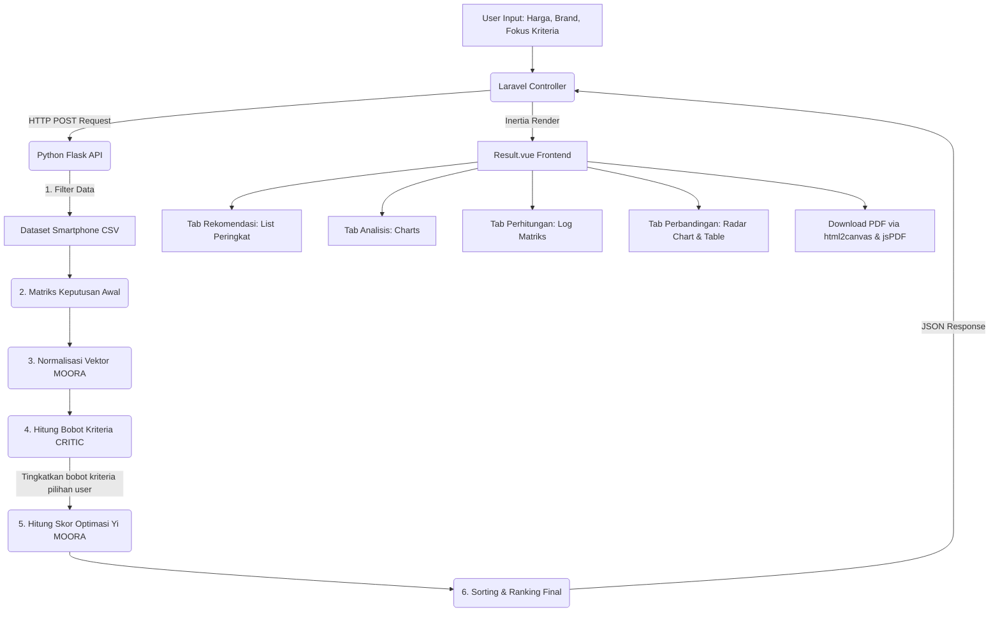

# Dokumentasi Sistem Pendukung Keputusan (DSS) Rekomendasi Smartphone

## Metode CRITIC - MOORA

Dokumentasi ini menjelaskan arsitektur, alur sistem (flow), diagram alur (flow diagram), diagram use case (usecase diagram), serta fitur-fitur dari Sistem Pendukung Keputusan (DSS) pemilihan smartphone entry-level.

---

## 🛠️ Tech Stack & Arsitektur Sistem

Aplikasi ini menggunakan arsitektur hybrid modern dengan memisahkan backend bisnis (Laravel), frontend dinamis (Vue + Inertia), dan mesin pemrosesan keputusan (Python Flask Engine).

- **Backend & Router Utama**: Laravel 11 (PHP 8.3)
- **Frontend**: Vue 3 (Inertia.js) + Tailwind CSS
- **DSS Engine (Microservice)**: Flask (Python 3.10)
- **Database**: MySQL (untuk autentikasi admin & data sinkronisasi)
- **Containerization**: Docker (Docker Compose) untuk standarisasi environment

---

## 📋 Fitur-Fitur Sistem

1.  **Halaman Rekomendasi (User)**:
    - Slider Filter Harga Maksimal (Mencapai Rp4.000.000).
    - Checkbox Filter Brand (Multi-select brand smartphone).
    - Pilihan Fokus Kriteria (Maksimal memilih 3 kriteria dari C1-C9).
2.  **Tab Hasil Rekomendasi (Result)**:
    - **Tab Rekomendasi**: Menampilkan Top 10 Smartphone hasil ranking MOORA, lengkap dengan spesifikasi rinci dan opsi centang _Compare_ (Bandingkan).
    - **Tab Analisis**: Visualisasi grafik batang untuk Bobot Kriteria (metode CRITIC) dan grafik garis untuk Distribusi Skor MOORA.
    - **Tab Perhitungan**: Menjabarkan seluruh langkah perhitungan matriks matematis dari data mentah, normalisasi, bobot korelasi CRITIC, optimasi MOORA, hingga ranking final.
    - **Tab Perbandingan**: Membandingkan spesifikasi teknis dan visualisasi grafik Radar untuk maksimal 3 smartphone pilihan pengguna.
    - **Export PDF**: Mengunduh seluruh ringkasan laporan hasil rekomendasi secara formal menggunakan library `jspdf` dan `html2canvas`.
3.  **Admin Dashboard**:
    - Manajemen dataset smartphone secara real-time.
    - Input data smartphone satu-per-satu secara manual.
    - Upload dataset CSV terbaru untuk memperbarui seluruh data sistem secara massal.
    - Sinkronisasi otomatis (Database Laravel File CSV di Flask Engine).

---

## 🔄 Alur Kerja Sistem (System Flow)

### 1. Tahap Input Pengguna (Frontend)

- Pengguna membuka browser dan mengakses `http://localhost:8001`.
- Pengguna memasukkan parameter filter:
  - **Batas Harga (Cost - C1)** (Contoh: Rp2.500.000).
  - **Pilihan Brand** (Contoh: Xiaomi, Samsung, Realme).
  - **Kriteria Kebutuhan Utama** (Maksimal 3 pilihan, contoh: _RAM Besar - C2_, _Baterai Besar - C6_, _AnTuTu Tinggi - C4_).
- Pengguna menekan tombol "Cari Rekomendasi".

### 2. Tahap Jembatan Rute (Laravel Controller)

- Inertia mengirimkan payload input ke `RecommendationController@calculate` (Laravel).
- Laravel melakukan validasi payload input.
- Laravel mengirimkan request HTTP POST internal ke microservice Python Flask pada port `http://flask_engine:5000/api/rekomendasi`.

### 3. Tahap Pemrosesan DSS (Python Engine)

- **Filtering**: Python membaca `dataset_smartphone.csv` dan memfilter data berdasarkan rentang harga dan brand pilihan pengguna.
- **Kriteria Fokus (ROC/CRITIC Boosting)**: Python mencatat kriteria fokus pilihan pengguna. Secara matematis, bobot dasar kriteria tersebut akan ditingkatkan secara signifikan dibanding kriteria lainnya.
- **Normalisasi Matriks (MOORA)**:
  - Membuat matriks keputusan dari kriteria C1 sampai C9.
  - Menghitung normalisasi vektor:
    $$x_{ij}^* = \frac{x_{ij}}{\sqrt{\sum_{i=1}^{m} x_{ij}^2}}$$
- **Bobot CRITIC**:
  - Menghitung standar deviasi ($\sigma$) untuk setiap kriteria.
  - Menghitung matriks korelasi antar kriteria ($r_{jk}$).
  - Menghitung nilai informasi kriteria ($C_j = \sigma_j \sum_{k=1}^{n} (1 - r_{jk})$).
  - Menghitung bobot objektif ($W_j = \frac{C_j}{\sum_{k=1}^{n} C_k}$).
- **Optimasi MOORA (Yi)**:
  - Skor optimasi dihitung berdasarkan selisih kriteria benefit dan cost yang dikalikan dengan bobot CRITIC:
    $$Y_i = \sum_{j=1}^{g} W_j x_{ij}^* - \sum_{j=g+1}^{n} W_j x_{ij}^*$$
- **Ranking**: Semua smartphone diurutkan dari skor optimasi $Y_i$ tertinggi ke terendah.
- Python mengembalikan hasil Top 10 beserta data langkah-langkah matriks perhitungannya dalam format JSON ke Laravel.

### 4. Tahap Output Hasil (Vue Frontend)

- Laravel menerima JSON dari Flask dan meneruskannya (render) ke halaman `Result.vue` menggunakan Inertia.
- Data diolah secara dinamis ke dalam tabs (Rekomendasi, Analisis, Perhitungan, Perbandingan) dan siap di-export ke PDF.

---

## 📊 Flow Diagram (Mermaid)

Di bawah ini adalah diagram alur proses pengolahan data rekomendasi dari input user hingga hasil akhir:



---

## 👥 Use Case Diagram (Mermaid)

Berikut adalah interaksi pengguna (User) dan Administrator (Admin) terhadap sistem rekomendasi smartphone:

```mermaid
left_to_right_direction
actor User as "Pengguna Biasa"
actor Admin as "Administrator"

rectangle "Sistem Rekomendasi Smartphone (CRITIC-MOORA)" {
    usecase UC1 as "Mengatur Filter Harga & Brand"
    usecase UC2 as "Memilih 3 Kriteria Fokus"
    usecase UC3 as "Melihat Rekomendasi & Ranking"
    usecase UC4 as "Melihat Hasil Analisis & Grafik"
    usecase UC5 as "Melihat Detail Langkah Perhitungan"
    usecase UC6 as "Membandingkan Smartphone (Compare)"
    usecase UC7 as "Mengunduh Laporan (Export PDF)"
    usecase UC8 as "Login / Register Akun Admin"
    usecase UC9 as "Menambah Data Smartphone Manual"
    usecase UC10 as "Upload File Dataset CSV Baru"
    usecase UC11 as "Sinkronisasi Data ke Engine Python"
}

User --> UC1
User --> UC2
User --> UC3
User --> UC4
User --> UC5
User --> UC6
User --> UC7

Admin --> UC8
Admin --> UC9
Admin --> UC10
Admin --> UC11

UC9 -.-> |include| UC11
UC10 -.-> |include| UC11
```

---

## 📝 Format Kolom Kriteria (C1 - C9)

Di dalam database dan dataset CSV, karakteristik smartphone diwakili oleh 9 kriteria berikut:

| Kode   | Kriteria     | Jenis (Attribute) | Deskripsi / Skala                                           |
| :----- | :----------- | :---------------- | :---------------------------------------------------------- |
| **C1** | Harga        | Cost              | Nilai nominal Rupiah (Makin rendah makin baik)              |
| **C2** | RAM          | Benefit           | Kapasitas RAM dalam GB                                      |
| **C3** | Storage      | Benefit           | Kapasitas memori internal dalam GB                          |
| **C4** | AnTuTu       | Benefit           | Nilai benchmark performa chipset                            |
| **C5** | Kamera       | Benefit           | Kapasitas kamera utama dalam Megapixel (MP)                 |
| **C6** | Baterai      | Benefit           | Kapasitas daya baterai dalam mAh                            |
| **C7** | Tipe Storage | Benefit           | Tipe transfer data internal (1: eMMC, 2: UFS)               |
| **C8** | Tipe Layar   | Benefit           | Teknologi panel layar (1: IPS/TFT, 2: AMOLED)               |
| **C9** | Resolusi     | Benefit           | Kualitas ketajaman layar (1: HD+, 2: FHD, 3: FHD+, 4: 1.5K) |
